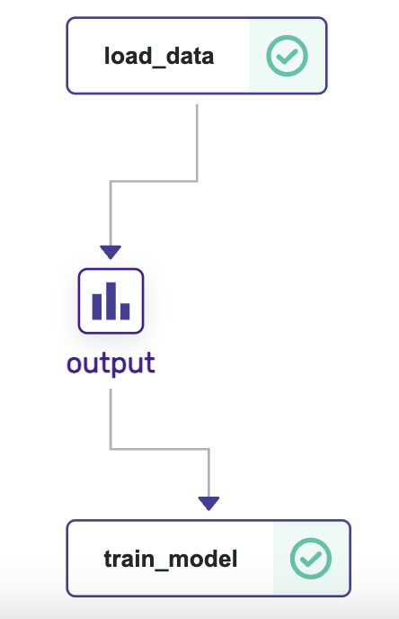

# zenml-example

## Install

```bash
pip install "zenml[server]"
```

This includes the UI / Dashboard.

## Commands

- `zenml up` - Open Dashboard
- `zenml show` - Reopen Dashboard
- `zenml down` - Shutdown local server

NOTE: Usually the pipelines give a connetion error if you try to run them while the server is up.... so best to do `zenml down` then run the code and then `zenml up`.

## Simple example

When you run a `pipeline` (e.g `run.py` -> @pipeline), each individual function that runs is shown in the DAG visualization as a `step` and is marked with the function name. Steps are connected with artifacts, which are simply the objects that are returned by these functions and input into downstream functions.



The artifacts produced by your steps are automatically stored and versioned by ZenML. The code that produced these artifacts is also automatically tracked. The parameters and all other configuration is also automatically captured.

```bash
python simple_example.py
zenml up
```

## More complex example

```bash
pip install matplotlib
zenml integration install sklearn -y
python more_complex_example.py
```
